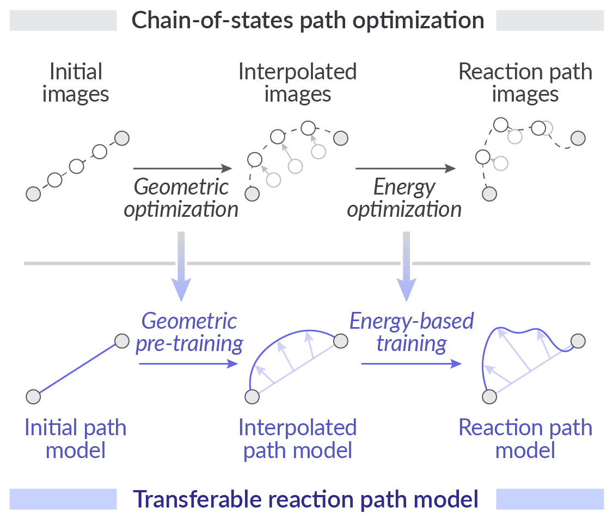

# MEPIN

[](https://arxiv.org/abs/2504.15370)
[](https://zenodo.org/doi/10.5281/zenodo.15315533)
[](https://opensource.org/license/mit)


This repository provides code for **MEP Inference Network (MEPIN)**, a model for transferable learning of reaction pathways.

📄 Preprint: [Transferable Learning of Reaction Pathways from Geometric Priors](https://arxiv.org/abs/2504.15370)

<p align="center">

</p>

## Setup

Clone the repository and install dependencies:

```bash
# Clone the repository
git clone https://github.com/learningmatter-mit/mepin.git
cd mepin

# Create conda environment
conda create -n mepin python=3.11
conda activate mepin

# Install torch (adjust the torch/CUDA version as needed)
pip install torch==2.4.1 --index-url https://download.pytorch.org/whl/cu124
pip install pyg_lib torch_scatter -f https://data.pyg.org/whl/torch-2.4.0+cu124.html

# Install the package
pip install -e .
# pip install -e .[dev]  # with additional packages for dev and training
```

## Data

Download data from [Zenodo](https://doi.org/10.5281/zenodo.15315533) and extract it into the `data/` directory.

```bash
data/
├── cyclo_xtb/  # [3+2] cycloaddition dataset
│   ├── xyz/
│   │   ├── 0_R.xyz  # optimized reactant structure
│   │   └── 0_P.xyz  # optimized product structure
│   ├── geodesic/
│   │   └── 0.xyz  # pre-generated geodesic path
│   ├── irc/
│   │   └── 0.xyz  # IRC path
│   └── split.csv  # train/test split information
└── t1x_xtb/  # Transition1x dataset
```

Geodesic paths are generated using [geodesic-interpolate](https://github.com/virtualzx-nad/geodesic-interpolate) package.
Note that the geometries are not pre-aligned, so the training and inference scripts will align the geometries on-the-fly.


## Model inference

The pre-trained model checkpoints are available in the `ckpt/` directory.
See the notebook `work/eval/inference_example.ipynb` for an example of the reaction path inference using the MEPIN model.


## Training

The training scripts for the models are located in the `scripts/` directory.
We use [Neptune](https://neptune.ai/) for experiment tracking.
Please set up your Neptune account and set the `NEPTUNE_API_TOKEN` environment variable to your Neptune API token.
Also, set the `NEPTUNE_PROJECT` variables in the scripts to your project name.
For MEPIN-L model training (`train_*_L.sh`), you additionally need to provide the pre-trained model checkpoint to the `GEODESIC_PATH` variable.

For energy-based training, it is recommended to use multiple GPUs, as described in the SI of the paper.
For example, on SLURM-based clusters, you can use `srun` to run the training scripts and provide additional arguments as follows:
```bash
+trainer.devices=$SLURM_NTASKS_PER_NODE
+trainer.num_nodes=$SLURM_NNODES
+trainer.strategy=ddp
```


## Citation
```
@misc{nam2025transferable,
    title={Transferable Learning of Reaction Pathways from Geometric Priors}, 
    author={Juno Nam and Miguel Steiner and Max Misterka and Soojung Yang and Avni Singhal and Rafael G\'omez-Bombarelli},
    year={2025},
    eprint={2504.15370},
    archivePrefix={arXiv},
    primaryClass={physics.chem-ph},
    url={https://arxiv.org/abs/2504.15370}, 
}
```